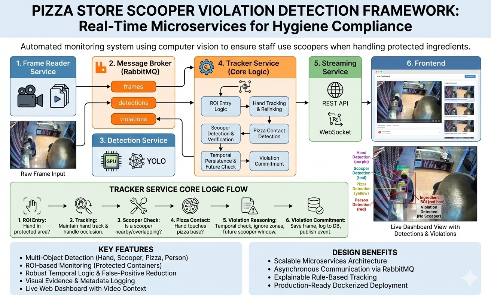

# Framework Services Documentation

This document describes the internal services of the Pizza Scooper Violation Detection Framework.
It is intended for developers, reviewers, and maintainers who want to understand how the system
works internally, how services communicate, and how violation logic is implemented.



## 1. Overall Architecture

The framework is designed as a microservices-based pipeline where each service has a single,
well-defined responsibility. Services communicate asynchronously via RabbitMQ.

High-level flow:

Frame Reader → Message Broker → Detection → Tracker → Streaming → Frontend

Each service can be run independently (local Python) or together (Docker Compose).

---

## 2. Frame Reader Service

### Purpose
The Frame Reader service ingests video sources and converts them into a stream of frames.

### Responsibilities
- Reads video files (.mp4, .mkv) or live streams.
- Samples frames at a configurable rate.
- Publishes frames to RabbitMQ.
- Cleans previous run artifacts (debug frames, violations, database) at startup.

### Input
- Video files from data/videos/.

### Output (RabbitMQ)
Queue: frames

Example message:
```json
{
  "source_id": "video_name.mp4",
  "frame_id": 123,
  "timestamp": 1700000000.0,
  "image": "<base64 JPEG>"
}
```

---

## 3. Message Broker (RabbitMQ)

### Purpose
Decouples services and enables asynchronous communication.

### Queues
- frames
- detections
- violations

RabbitMQ allows services to scale independently and provides buffering and fault tolerance.

---

## 4. Detection Service

### Purpose
Runs deep learning inference on frames.

### Responsibilities
- Consumes frames from RabbitMQ.
- Runs YOLO-based object detection.
- Publishes detections downstream.

### Output (RabbitMQ)
Queue: detections

```json
{
  "source_id": "video_name.mp4",
  "frame_id": 123,
  "timestamp": 1700000000.0,
  "detections": [
    {
      "label": "hand",
      "confidence": 0.93,
      "bbox_xyxy": [x1, y1, x2, y2]
    }
  ],
  "image": "<base64 JPEG>"
}
```

---

## 5. Tracker Service (Core Logic)

### Purpose
The Tracker service is the core intelligence of the system. It transforms raw detections
into semantic actions and determines whether a hygiene violation occurred.

---

### 5.1 Responsibilities
- Maintain a single active hand track per video source.
- Detect meaningful ROI entry.
- Track hands across frames using IOU and proximity.
- Detect pizza contact.
- Verify scooper usage.
- Apply temporal persistence and future checks.
- Commit violations and publish events.

---

### 5.2 ROI Entry Logic
A track starts only when:
1. Hand center is inside the ROI.
2. At least 66% of sampled bbox points OR 2 bbox corners are inside the ROI.

This prevents false starts from partial or noisy detections.

---

### 5.3 Track Persistence
- Majority-start tracks persist for a minimum number of frames.
- Tracks survive short occlusions.
- Tracks expire after a configurable lifetime.

---

### 5.4 Hand Relinking
If a hand is missed:
1. IOU matching is attempted.
2. Proximity relinking to the last anchor is attempted.
3. Anchor is retained if both fail.

---

### 5.5 Scooper Detection
Scooper usage is confirmed if:
- Scooper is within a strict distance threshold from the hand, OR
- Scooper overlaps the hand bbox beyond a small IOU threshold.

Scooper frames are recorded for temporal reasoning.

---

### 5.6 Pizza Contact Detection
- Hand and pizza must overlap beyond a minimum IOU.
- Contact must persist for multiple sampled frames.

---

### 5.7 Pending Violation & Future Check
When pizza contact occurs without a recent scooper:
1. A pending violation is created.
2. The system waits a short future window.
3. If a scooper appears, the violation is canceled.
4. Otherwise, the violation is committed.

---

### 5.8 Ignore Zones
- Hands already interacting with pizza create temporary ignore zones.
- Nearby hands entering pizza shortly after are ignored.
- Reduces cross-hand false positives.

---

### 5.9 Violation Commitment
On violation:
- Frame is saved to data/violations/.
- Record inserted into SQLite database.
- Violation event published to RabbitMQ.

---

## 6. Streaming Service

### Purpose
Exposes results to clients.

### Responsibilities
- Consume detections and violations.
- Maintain in-memory violation cache.
- Serve REST endpoints and WebSocket streams.

---

## 7. Frontend

### Purpose
Visualizes detections and violations.

### Features
- Live bounding boxes and ROIs.
- Violation thumbnails.
- Clickable video context.
- Real-time WebSocket updates.

---

## 8. Design Considerations

- Rule-based tracking provides explainability.
- Single-hand tracking simplifies logic.
- Temporal windows reduce false positives.

---

## 9. Extensibility

Possible future improvements:
- Multi-hand tracking.
- Model fine-tuning.
- Camera calibration.
- Cloud deployment.

---

## 10. Summary

This framework combines deep learning and deterministic logic to deliver a robust,
explainable hygiene monitoring system. The Tracker service is the heart of the system,
bridging low-level detections and high-level violation events.
